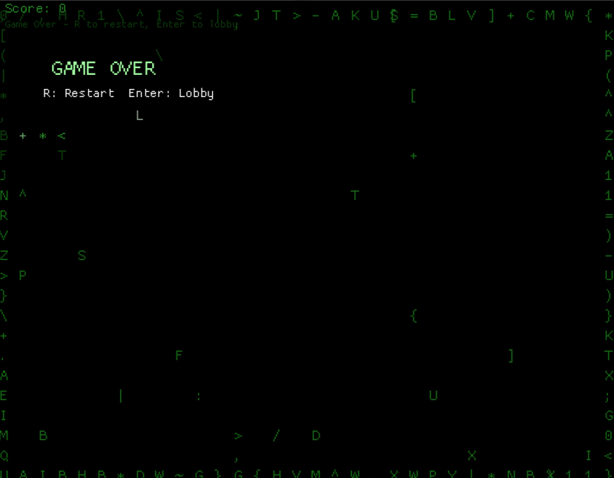

# Snake - Matrix Style

A retro-style Snake game built with Rust and Macroquad, featuring a Matrix-inspired aesthetic with procedural map generation and dynamic gameplay.



## Features

### 🎮 Core Gameplay
- **Classic Snake mechanics** with smooth movement and collision detection
- **Procedural map generation** with configurable wall density
- **Configurable game speed** for different difficulty levels
- **Score tracking** with persistent best score storage

### 🎨 Visual Design
- **Matrix-inspired aesthetic** with green color palette
- **Dynamic glyph rendering** using Matrix-style characters (0, 1, <, >, [, ], etc.)
- **Animated Matrix rain background** for immersive atmosphere
- **Responsive scaling** that adapts to different screen sizes

### 🔊 Audio
- **Procedurally generated sound effects** using WAV synthesis
- **Eat sound** (880Hz tone) when consuming food
- **Death sound** (110Hz tone) when game ends

### 💾 Data Persistence
- **Save system** using JSON for game settings and high scores
- **Persistent configuration** of last used seed, wall density, and speed
- **Best score tracking** across game sessions

## Controls

### In-Game
- **Arrow Keys** or **WASD** - Move the snake
- **R** - Restart game (when game over)

### In Lobby
- **Enter** - Start new game
- **R** - Generate new random seed
- **- / +** - Decrease/Increase wall density (0-35%)
- **[ / ]** - Decrease/Increase game speed (50-350ms)

## Technical Details

### Architecture
- **State-based design** with three main screens: Lobby, Playing, GameOver
- **Modular components** for map generation, snake logic, and rendering
- **Efficient collision detection** using HashSet for wall positions
- **Deterministic map generation** using seeded random number generation

### Performance
- **60 FPS target** with smooth frame timing
- **Efficient rendering** with glyph-based graphics
- **Memory-efficient** data structures for game state

### Dependencies
- **macroquad 0.4** - Cross-platform game framework
- **serde** - Serialization for save data
- **serde_json** - JSON format support

## Installation & Running

### Prerequisites
- Rust 1.70+ with Cargo
- OpenGL 3.3+ compatible graphics card

### Build & Run
```bash
# Clone the repository
git clone <repository-url>
cd snake_macroquad

# Run the game
cargo run --release
```

### Development
```bash
# Run in debug mode
cargo run

# Build for release
cargo build --release
```

## Game Configuration

### Map Generation
- **Seed-based generation** ensures reproducible maps
- **Wall density** controls difficulty (0-35% of cells)
- **Safe spawn area** prevents immediate collision

### Gameplay Settings
- **Move interval** controls snake speed (50-350ms)
- **Grid size** is fixed at 32x24 tiles
- **Tile size** scales with screen resolution

## File Structure

```
snake_macroquad/
├── src/
│   └── main.rs          # Main game logic and rendering
├── img/
│   └── game_over.png    # Screenshot for documentation
├── Cargo.toml           # Project dependencies
├── Cargo.lock           # Dependency lock file
├── snake_save.json      # Persistent save data (auto-generated)
└── README.md            # This file
```

## Code Highlights

### Matrix Glyph System
```rust
const MATRIX_GLYPHS: &[u8] = b"01<>[]{}()/\\|-=+*;:.,^~ABCDEFGHIJKLMNOPQRSTUVWXYZ";

fn matrix_char_for_cell(c: Cell) -> char {
    let hx = (c.x as i64).wrapping_mul(73_856_093);
    let hy = (c.y as i64).wrapping_mul(19_349_663);
    let h = (hx ^ hy).unsigned_abs() as usize;
    MATRIX_GLYPHS[h % MATRIX_GLYPHS.len()] as char
}
```

### Procedural Map Generation
```rust
fn generate(seed: u64, wall_density: f32) -> Self {
    macroquad::rand::srand(seed);
    // Generate border walls and random interior walls
    // Ensure safe spawn area around center
}
```

### Sound Generation
```rust
fn generate_wav_sine(frequency_hz: f32, duration_seconds: f32, volume: f32) -> Vec<u8> {
    // Generate WAV file data for simple sine wave tones
}
```

## Contributing

Feel free to submit issues, feature requests, or pull requests to improve the game!

## License

This project is open source. Feel free to use and modify as needed.

---

*Built with ❤️ using Rust and Macroquad*